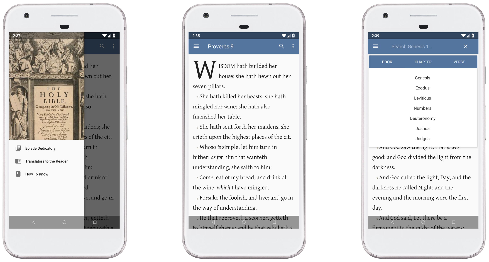

<h3 align="center"></h3>

Kitvei is a free and open source Bible for Android. 

   

Aimed towards providing the best English version. Translations are from the PCE and 1611 KJV.

## Features
- Fast (*Loads instantly for optimal reading pleasure*).
- Lightweight (*Low on CPU/Memory usage*).
- No unnecessary permissions.
- Swipe the next chapter like a book.
- Completely offline.
- Includes the 1611 KJV introductions.
- Find in page.
- Search verses.
- Copy single verses.
- Adjust text size.
- Toggle paragraphs, line numbers, red letters, and more. (*Soon*)
- Toggle 1611 KJV punctuation and capitalisation.

**Note:** This is a personal project of mine that I've released publicly. Therefore it is a work in-progress. If you break it, let me know!

## Motivation
I wanted a pure English Bible which was not tampered by men who added or removed parts of scripture, mainly because they used alternate manuscripts that deviated from the original. I stumbled upon the PCE and this translation did well in preserving the original into our lexicon. I'm convinced The Word is perfect but translations can have mistakes. As for English, this is currently the best translation we have, but do make sure to confirm with the original Greek and Hebrew.

## Download
Get the app from the [releases page](https://github.com/inshiro/Kitvei/releases).

## Contributing

### Issues

In any project it's likely that a few bugs will slip through the cracks, so it
helps greatly if people document any bugs they find to ensure that they get
fixed promptly.

You can view a list of known issues and feature requests using [the issue tracker](
https://github.com/inshiro/Kitvei/issues). If you don't see your issue (or you
aren't sure) feel free to [submit it!](https://github.com/inshiro/Kitvei/issues/new)

Where appropriate, a screenshot works wonders to help us see exactly what the
issue is. You can upload screenshots directly using the GitHub issue tracker or
by attaching a link (to Imgur, for example), whichever is easier for you.

### Code

If you are a developer and wish to contribute to the app please fork the project
and submit a pull request.

If you have any questions, feel free to [send me an email](<mailto:iitsbalance@gamil.com>)
If enough people are interested a discord chat will be made.  

## TODO

- [ ] Themes
- [ ] Settings option
- [ ] Notes and Highlights

  
## License

    Copyright 2018 inshiro

    Licensed under the Apache License, Version 2.0 (the "License");
    you may not use this file except in compliance with the License.
    You may obtain a copy of the License at

    http://www.apache.org/licenses/LICENSE-2.0

    Unless required by applicable law or agreed to in writing, software
    distributed under the License is distributed on an "AS IS" BASIS,
    WITHOUT WARRANTIES OR CONDITIONS OF ANY KIND, either express or implied.
    See the License for the specific language governing permissions and
    limitations under the License.
